## Git 使用指南

本文档用于介绍 Git 的基础协作流程，包括代码克隆、拉取更新、分支开发、提交推送和 Pull Request 创建。

## 0. VS Code 中 Git 插件安装

在 VS Code 中使用 Git 前，建议先安装以下三个插件：
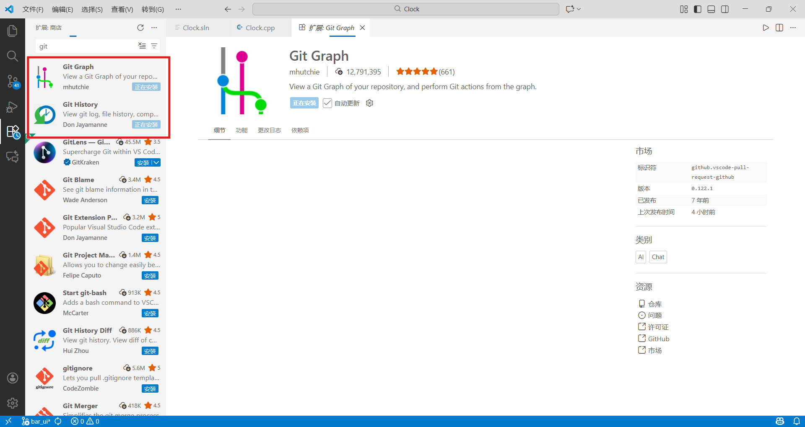
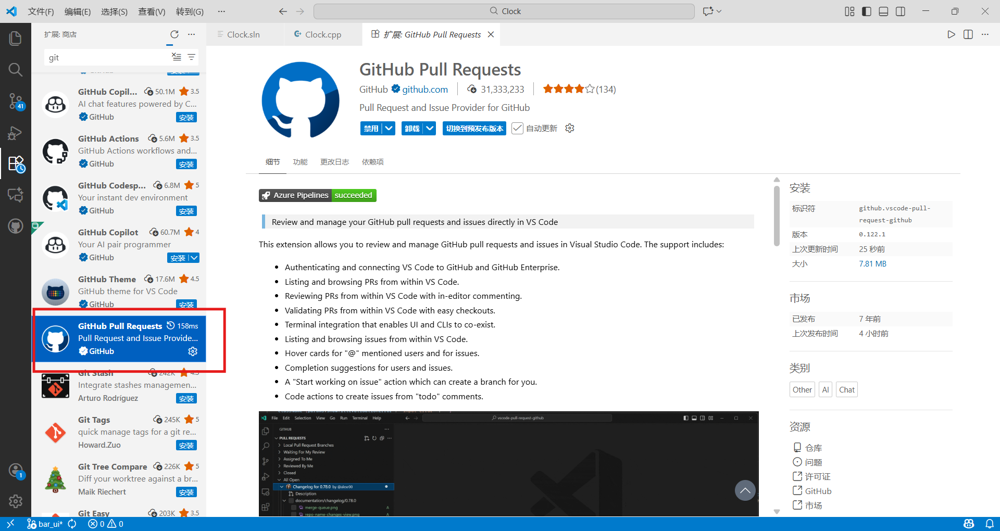

安装方法：点击左侧导航栏的“扩展”，搜索对应插件名称并安装。

## 1. git clone（克隆仓库）

`git clone` 是在新电脑或新环境开始开发时的第一步。它会把远程仓库（Remote Repository）完整下载到本地。

### 基本用法

先在 GitHub 打开仓库页面，点击 `Code`，复制 `Clone using the web URL` 对应的地址。

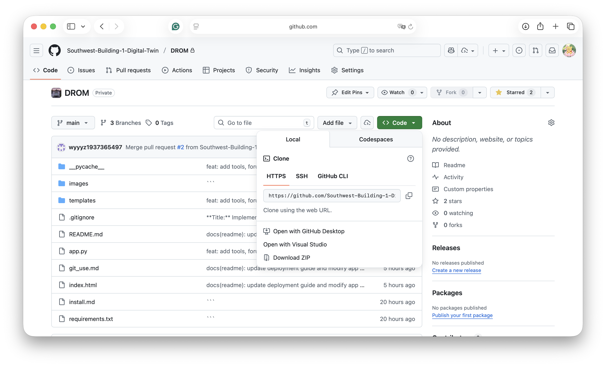

然后在你希望保存项目的文件夹中打开终端，执行：

```bash
git clone <仓库地址>
```

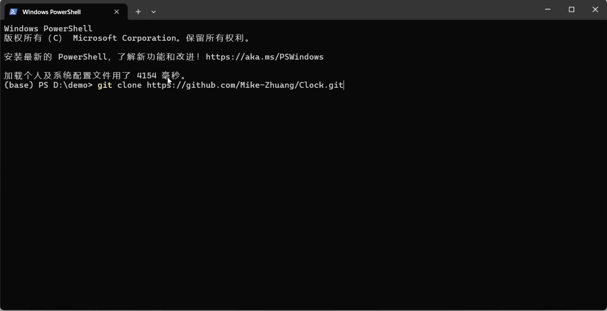

执行后等待下载完成，出现下图所示内容即表示克隆成功。

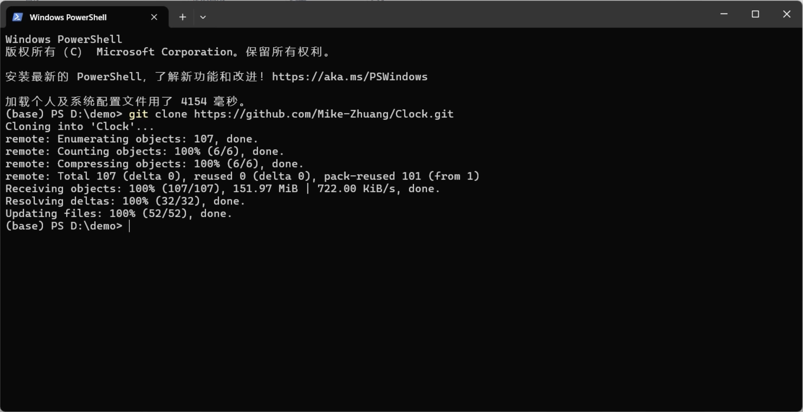

### 克隆指定分支

如果只想克隆某个分支（而不是默认 `main` / `master`），可以使用 `-b` 参数：

```bash
git clone -b <分支名称> <仓库地址>
# 示例：克隆 develop 分支
git clone -b develop git@github.com:username/repo-name.git
```

---

## 2. git pull（拉取更新）

`git pull` 用于从远程仓库获取最新代码，并合并到你当前本地分支，是多人协作中最常用的同步命令。

在 VS Code 中，点击左侧“源代码管理”可看到相关操作入口：

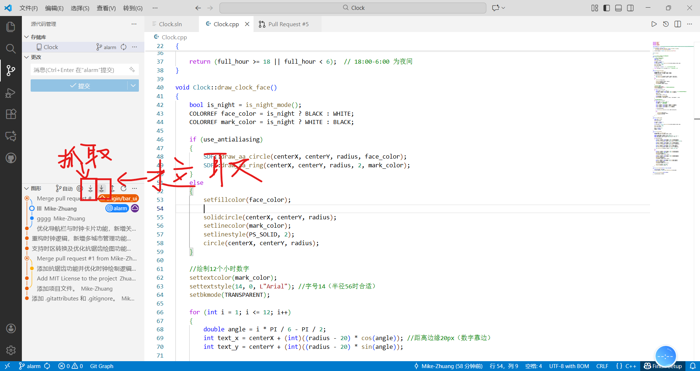

这里常见的两个操作是 `fetch`（抓取）和 `pull`（拉取），区别如下。

#### 1. git fetch（抓取）

`git fetch` 是一个相对安全的命令。

- **作用**：连接远程仓库，下载最新提交到本地 `.git` 中，但不会改动当前工作区文件。
- **理解方式**：相当于先把“远程更新”取回本地查看，不立即合并。
- **适用场景**：你想先确认变更内容，再决定是否合并。

#### 2. git pull（拉取）

`git pull` 本质上是两个命令的组合：

1. `git fetch`：下载远程提交记录。
2. `git merge`：把更新合并到当前分支。

- **作用**：下载并立刻尝试合并更新。
- **风险**：若本地与远程改动冲突，会直接进入冲突处理流程。

### 常见问题：冲突（Conflict）

例如你和同学都修改了同一个文件，远程已有对方提交，此时执行 `git pull` 就可能产生冲突。

**处理步骤：**

1. 终端会提示 `CONFLICT (content): Merge conflict in <文件名>`。
2. 打开冲突文件，会看到类似如下标记：
   ```text
   <<<<<<< HEAD
   这是你本地的修改内容
   =======
   这是远程拉取下来的修改内容
   >>>>>>> branch-name
   ```
3. 手动保留正确内容，并删除 `<<<<<<<`、`=======`、`>>>>>>>` 标记。

---

## 3. 分支概念（Branches）

分支可以理解为“并行开发线”。

- **主分支（main/master）**：通常保存稳定、可用版本。
- **功能分支（feature/xxx）**：用于开发新功能，不直接影响主分支稳定性。

### 为什么要使用分支

1. **隔离开发**：多人并行开发，互不干扰。
2. **安全试错**：新功能先在分支验证，失败也不会破坏主分支。

下图是分支关系示意：
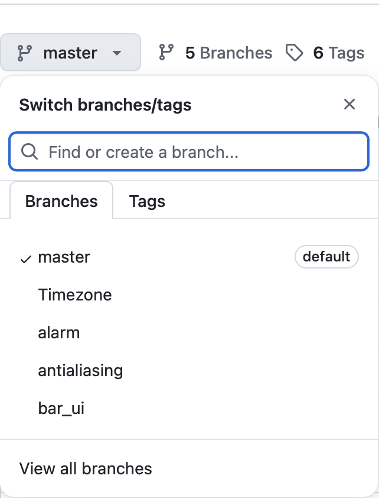

---

## 4. 在 VS Code 中推送分支并协作

在 VS Code 中，大多数 Git 操作都在左侧“源代码管理（Source Control）”面板完成。

### 1. 创建分支

1. 打开源代码管理，点击“视图和更多操作”。

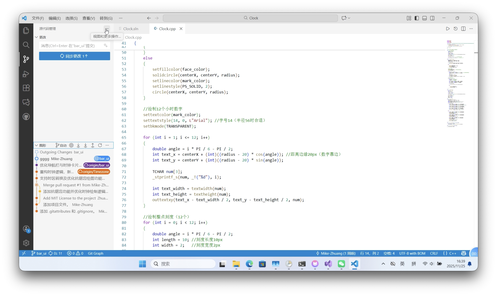

2. 选择“存储库”。


3. 点击存储库右侧的“...”。

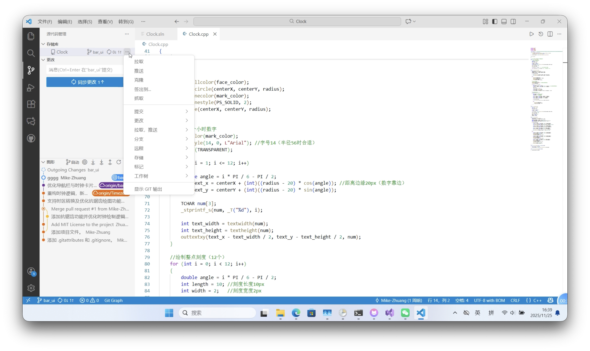

4. 选择“分支 -> 创建分支”。

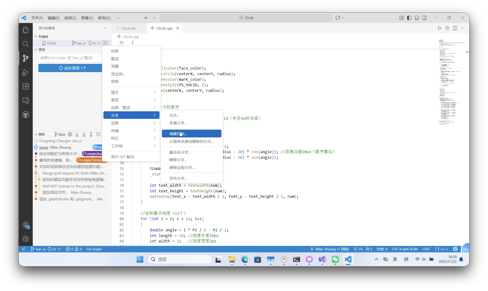

5. 输入分支名称并确认。

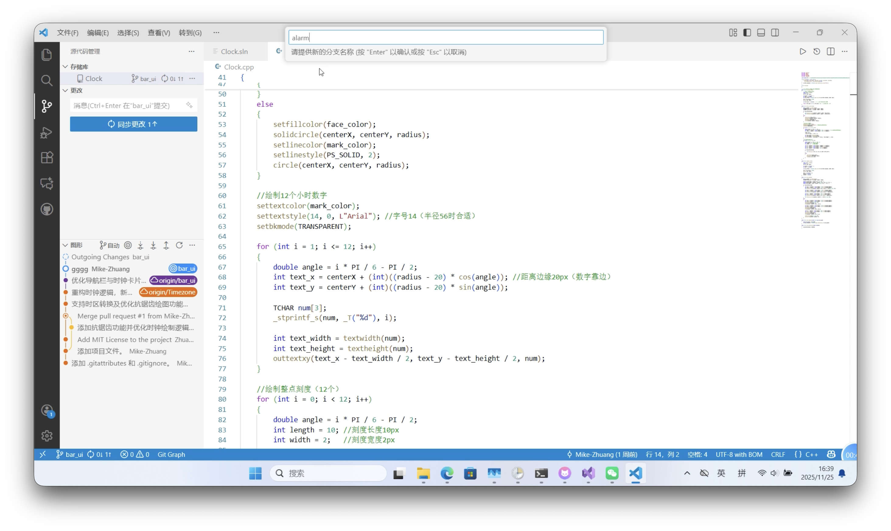

### 2. 发布分支

在“消息”框填写本次改动说明（也可用右侧星标功能自动概括），然后点击“发布 Branch”。

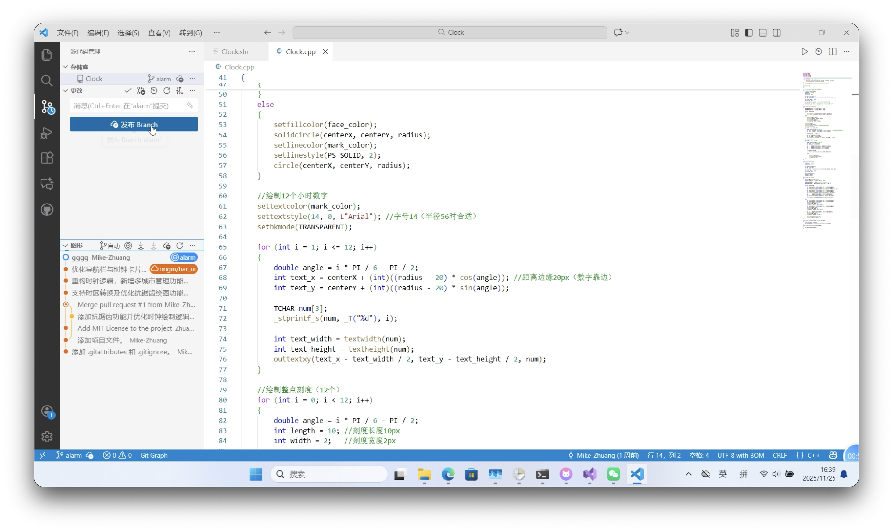

### 3. 同步改动到远程分支

1. 填写提交说明。

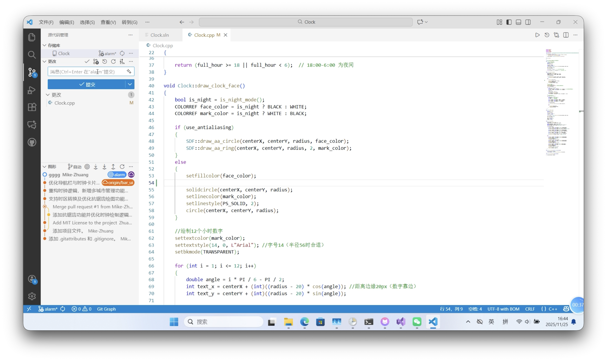

2. 点击提交。


3. 点击“同步更改”。

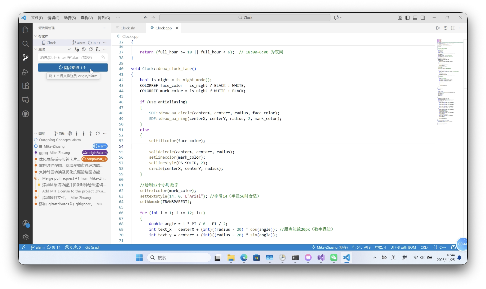

4. 在弹窗中点击确定。


5. 等待完成后即表示上传成功。

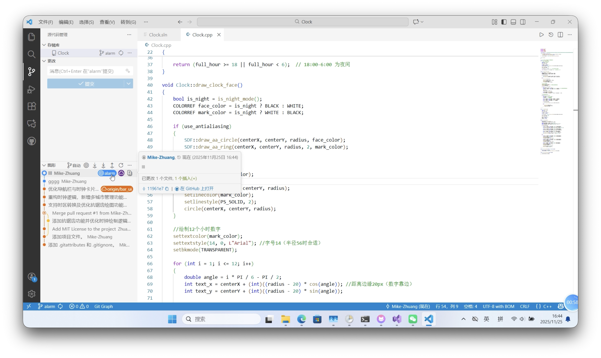

### 4. 创建 Pull Request

1. 点击左侧导航栏的 GitHub 图标（未登录则先点击 `Sign in`，按浏览器提示登录）。

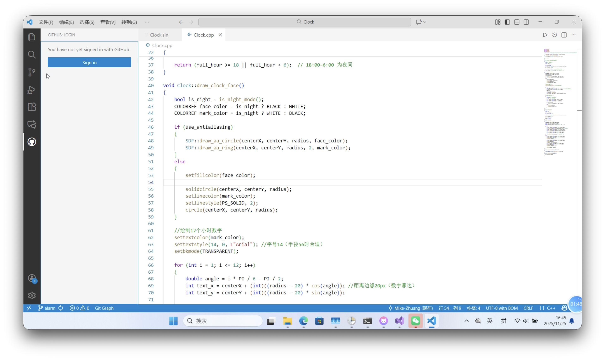

2. 点击 `PULL REQUESTS` 旁边的创建图标。

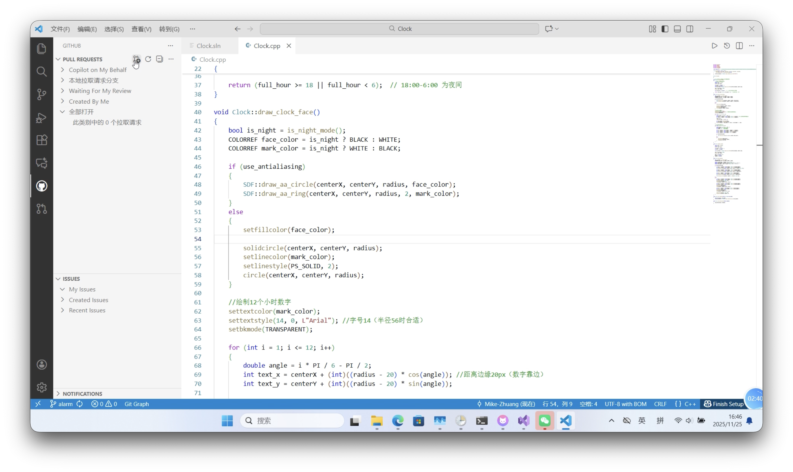

3. `BASE` 选择目标远程分支，`MERGE` 选择你当前分支，填写变更说明后点击 `Create`。

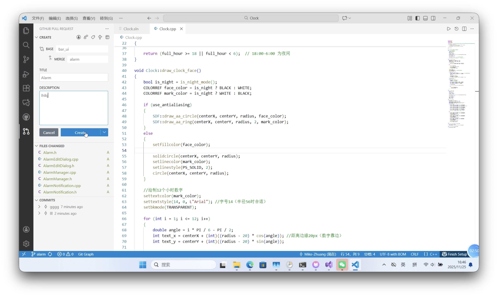

4. 出现如下 Pull Request 页面即表示创建成功，等待管理员审核并合并。

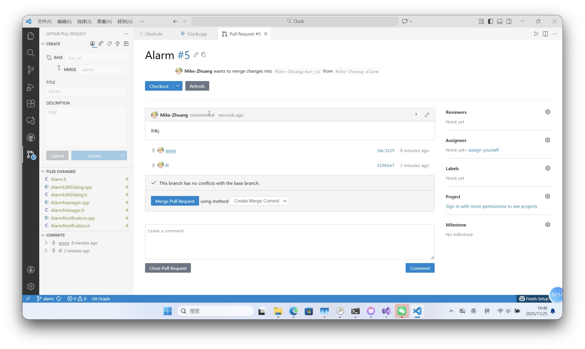

