# Homework Session 2

## 开发环境安装说明

建议按步骤完成 Git、Python（Miniconda）和 VS Code 的安装配置。

## Git 与 Python 环境部署教程

如不熟悉相关工具，请按顺序操作。遇到常见问题请先自行检索，再在群内提问：别**无脑乱问**，先查资料并描述清楚问题。

### Git（代码同步工具）

建议在可访问外网的环境下完成安装。

下载地址：
[Git - Install for Windows](https://git-scm.com/install/windows)

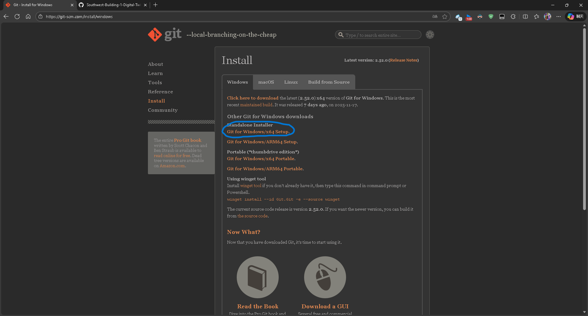

点击下载。

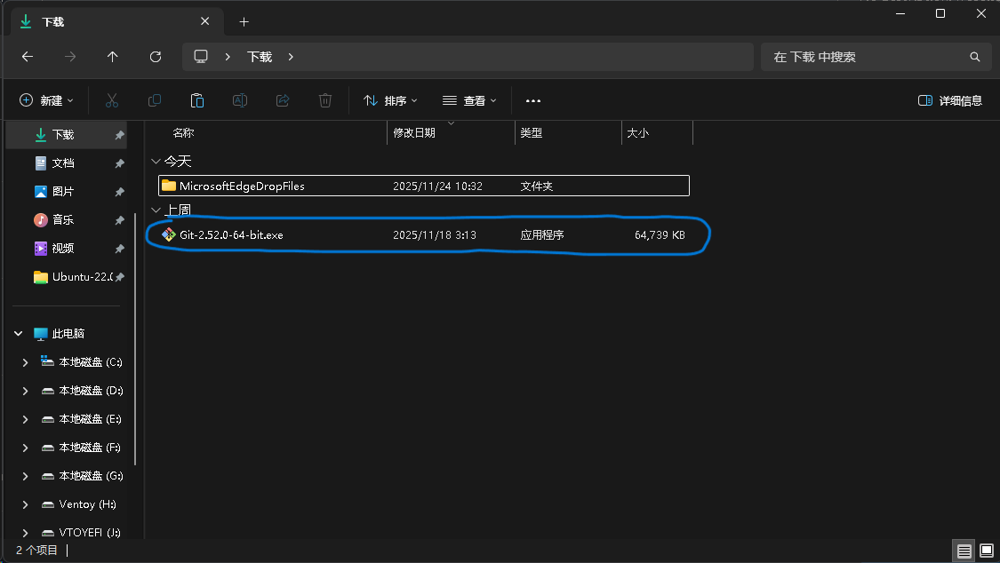

下载后双击安装程序运行。

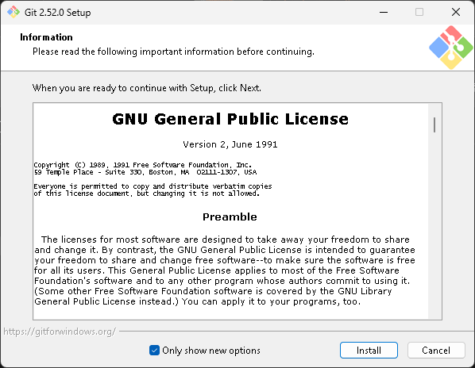

安装过程中保持默认选项即可，安装路径可自行选择。

### Python（Miniconda）

项目建议使用 Miniconda 管理 Python 环境。

下载地址：
[Free Download | Anaconda](https://www.anaconda.com/download)

打开页面后滚动到下方，选择 Miniconda 对应版本下载。

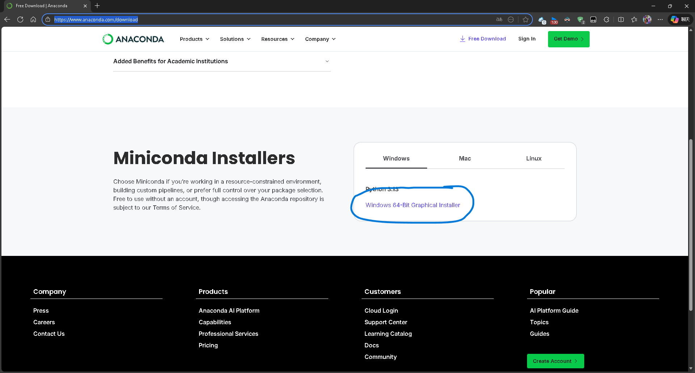
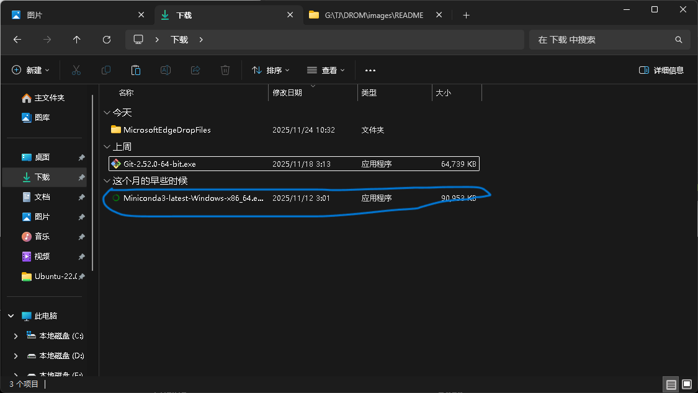
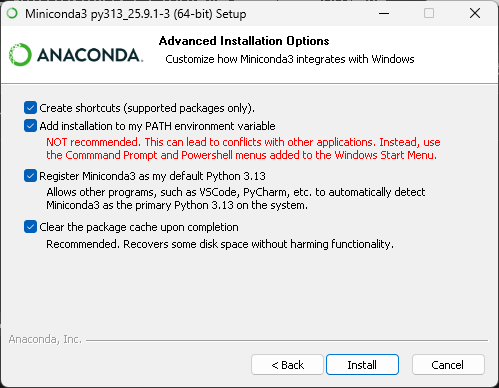

安装选项建议按图配置，便于后续在 VS Code 中调用 Python 环境。

安装完成后，以管理员身份打开终端：

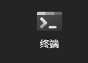

执行：

```bash
conda init --all
```

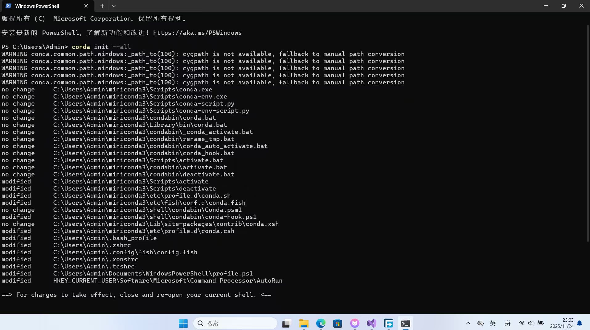

看到类似输出后，关闭终端并重新打开（建议此时关闭代理），再执行以下命令：

```bash
conda tos accept --override-channels --channel https://repo.anaconda.com/pkgs/main
conda tos accept --override-channels --channel https://repo.anaconda.com/pkgs/r
conda tos accept --override-channels --channel https://repo.anaconda.com/pkgs/msys2
conda config --add channels https://mirrors.tuna.tsinghua.edu.cn/anaconda/pkgs/main/
conda config --add channels https://mirrors.tuna.tsinghua.edu.cn/anaconda/pkgs/free/
conda config --add channels https://mirrors.tuna.tsinghua.edu.cn/anaconda/cloud/conda-forge/
conda config --add channels https://mirrors.tuna.tsinghua.edu.cn/anaconda/cloud/msys2/
conda config --add channels https://mirrors.tuna.tsinghua.edu.cn/anaconda/cloud/bioconda/
conda config --add channels https://mirrors.tuna.tsinghua.edu.cn/anaconda/cloud/menpo/
conda config --add channels https://mirrors.tuna.tsinghua.edu.cn/anaconda/cloud/pytorch/

pip config set global.index-url https://pypi.tuna.tsinghua.edu.cn/simple
```

### VS Code

下载地址：
[Download Visual Studio Code - Mac, Linux, Windows](https://code.visualstudio.com/Download)

安装完成后，建议至少安装以下扩展：

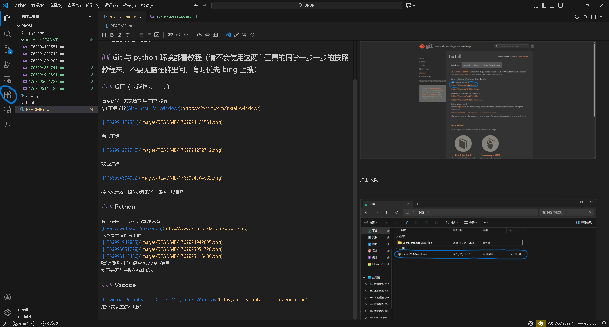

搜索 `Chinese`，安装中文语言包。

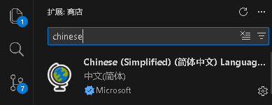

搜索 `Python`，安装 Python 官方扩展。

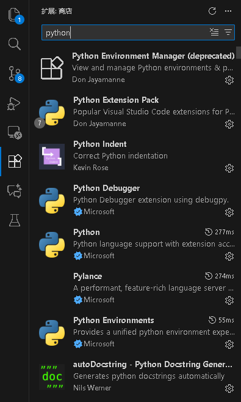

按以上配置完成后，即可开始项目开发。

