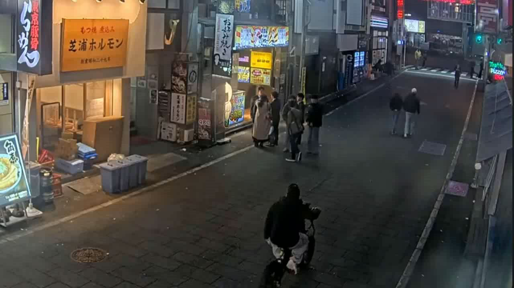
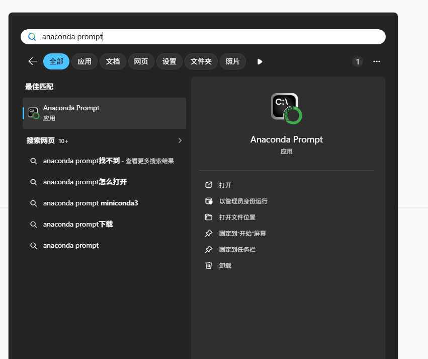
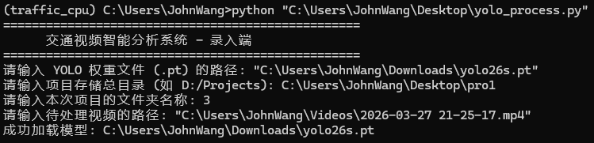
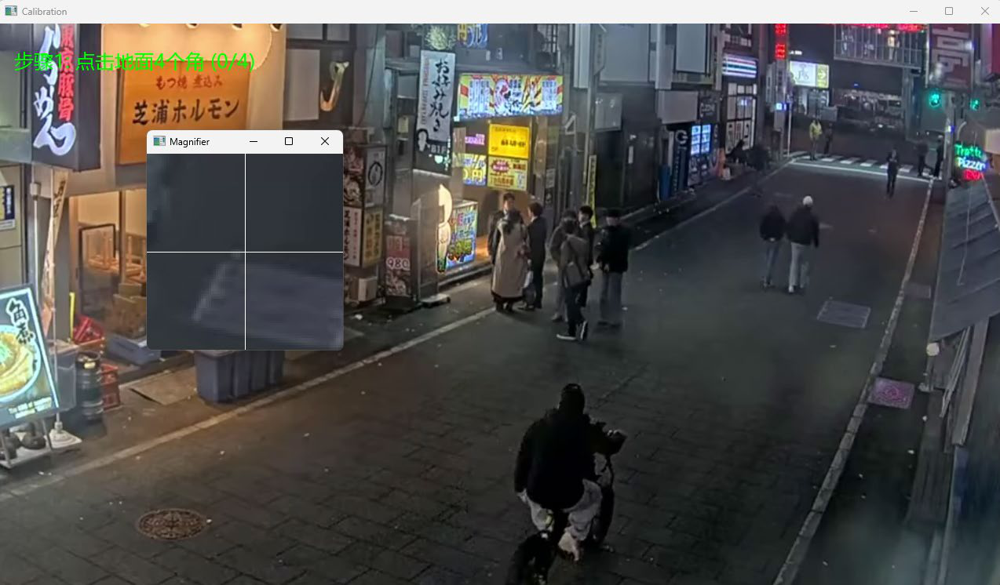
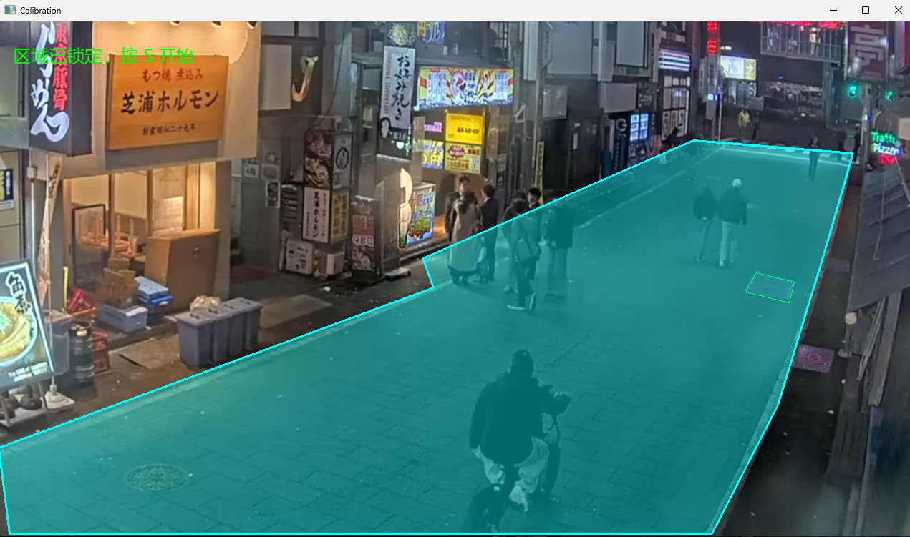
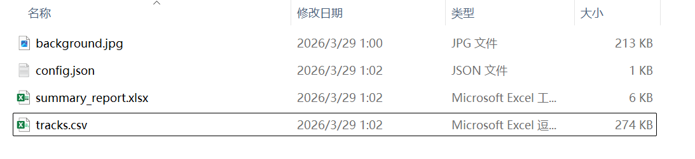
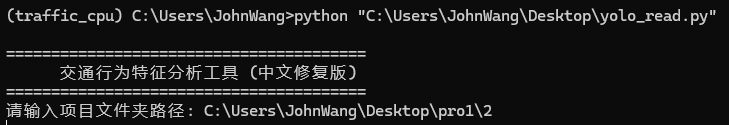
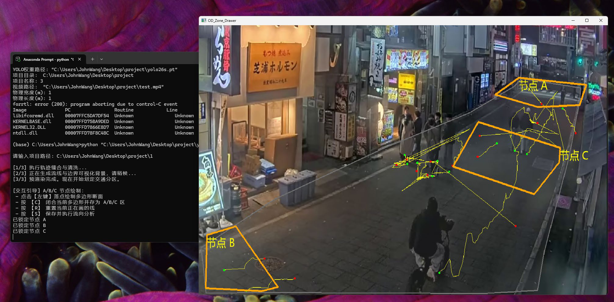
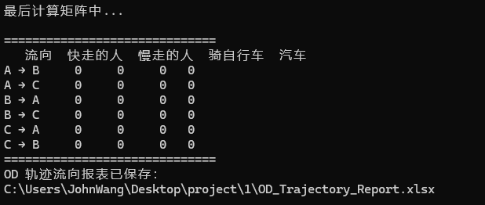
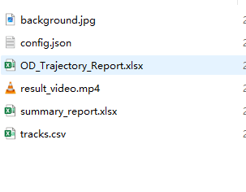

# YOLO 人车交通识别 — 技术操作说明

**原始 PDF**：project/YOLO人车交通识别操作说明.pdf

## 目录

- [概览](#概览)
- [关键要点速览](#关键要点速览)
- [拍摄要求与点位选择](#拍摄要求与点位选择)
- [环境与依赖安装（示例）](#环境与依赖安装示例)
- [运行脚本（示例）](#运行脚本示例)
- [逆透视矫正（标定）](#逆透视矫正标定)
- [数据导出格式](#数据导出格式)
- [自定义人流统计](#自定义人流统计)
- [流向统计示例](#流向统计示例)
- [兜底方案与人工校验](#兜底方案与人工校验)
- [图像与资源位置](#图像与资源位置)
- [附：逐页要点（参考）](#附逐页要点参考)

---

## 概览

本说明基于原始 PPT/PDF，整理为面向工程的操作文档，保留原始要点与示意图，去除临时提取脚本和冗余调试信息以便直接用于部署与运行。

---

## 关键要点速览

- 使用 YOLO 框架对人、车、自行车等目标进行检测与跟踪；通过逆透视标定将像素运动转换为实际速度。
- 拍摄时需保证地面标注矩形（用于标定）、视野覆盖目标入口/出口、环境光线充足且画面稳定。
- 建议用 Anaconda 管理 Python 环境（示例使用 Python 3.12）。

---

## 拍摄要求与点位选择

- 地面须标注一个有尺寸的矩形（用于逆透视和速度计算）。
- 优先高处俯拍以减少遮挡，确保能完整看到人/车与其接地点（bounding box 底部中心接近人的脚）。
- 环境光线充足且摄像机稳定，视野尽量覆盖全部出入口。

示意图（示例）：



---

## 环境与依赖安装（示例）

以下为 PPT 中给出的安装步骤与注释（已保留原注释，按需粘贴到命令行/脚本中执行）：

```bash
# 1. 设定清华源 (如果之前设过可以跳过)
conda config --add channels https://mirrors.tuna.tsinghua.edu.cn/anaconda/pkgs/free/
conda config --add channels https://mirrors.tuna.tsinghua.edu.cn/anaconda/pkgs/main/
conda config --set show_channel_urls yes
# 2. 创建 Python 3.12 环境
conda create -n traffic_cpu python=3.12 -y
# 3. 激活环境
conda activate traffic_cpu
# 设定 pip 清华源加速
pip config set global.index-url https://pypi.tuna.tsinghua.edu.cn/simple
# 安装核心库 (会自动安装轻量版 Torch 和所有依赖)
pip install ultralytics deep-sort-realtime pandas openpyxl pillow opencv-python
```

说明：上述为示例命令，实际环境名称与版本请根据你的系统与需求调整（例如可用已有 `yolo` 环境替代 `traffic_cpu`）。

示意：



---

## 运行脚本（示例）

项目中常见脚本：

- `yolo_process.py`：处理视频/图片，执行检测、跟踪并导出结果（按提示输入路径与文件夹名）。
- `yolo_read.py`：对导出结果进行交互式可视化统计，点选出入口区域生成汇总表格。

命令示例：

```bash
python path/to/yolo_process.py
python path/to/yolo_read.py
```

（具体脚本参数按项目中脚本头部的使用说明执行。）

示意图：



---

## 逆透视矫正（标定）

操作要点：

- 依次点击预设矩形四个角（左上、右上、右下、左下）。
- 输入矩形的宽（左上到右上）和高（左上到左下），作为物理尺度参考。 
- 绘制地面区域，点选后按 `C` 键闭合以完成标定。

示意图：




---

## 数据导出格式

导出数据包含每个跟踪对象的基本字段：`ID`、`Type`、`平均速度 (m/s)` 等。示例（节选）：

```
ID
Type
平均速度
(m/s)
1
Person
2.432
14
Person
1.943
...
```

示意图：



---

## 自定义人流统计

使用 `yolo_read.py` 填入结果目录后，可交互式点选出入口区域，程序会统计经过各入口的对象类型并输出表格/可视化图表，便于后续分析。

示例：





---

## 流向统计示例

示例表格（节选）：

```
流向  快走的人  慢走的人  骑自行车  汽车
A→B   0        0         0       0
A→C   1        0         0       0
...（完整示例见项目数据）
```

示意图：



---

## 兜底方案与人工校验

建议：每个出入口安排人工计数并录像用于验证与估速；可让一位同学匀速走作为对比样本，便于评估速度判定阈值。

示意图：


---

## 图像与资源位置

项目中使用的示意图与导出图片位于：`doc_images/YOLO_manual_images/`。

（若某些示意图在你的本地显示为黑图，请使用更高分辨率或 pdf 原文件重新导出；当前仓库中存在备份目录 `doc_images/YOLO_manual_images/backup_deleted/`，存放原始提取出的黑图备份。）

---

## 附：逐页要点（参考）

为保持文档简洁，此处仅保留每页要点索引。若需要完整的逐页原文（原始自动提取结果），请回复我，我会恢复完整原始提取文本到附录中供核对。

- 页面 1：封面与项目名称。
- 页面 2：拍摄要求与点位选择（地面矩形、俯拍、明亮等）。
- 页面 3：软硬件准备与 Anaconda 提示。
- 页面 4：环境与依赖安装示例（见上文命令）。
- 页面 5：脚本调用与运行示意。
- 页面 6-7：逆透视标定步骤与示意。
- 页面 8：导出字段与数据示例。
- 页面 9-10：人流/流向统计示例与可视化。
- 页面 11：兜底方案与人工校验建议。

---

如果你同意我现在把 `tools/` 下的辅助脚本永久删除（这些脚本是临时用于提取的），我会继续执行并把 `tools/` 中相关文件删除；否则我会保留备份并仅从文档中移除引用。

---

## 概览

本说明整理自原始 PDF，保留所有信息并在不改变原意的前提下对内容进行重排与格式化，方便阅读与实操。文档涵盖拍摄规范、环境配置、脚本运行、逆透视标定、数据格式与可视化等。

---

## 关键要点速览

- 拍摄建议：选择开阔、明亮、俯拍角度，确保能看到进出口与完整的地面矩形区域；YOLO 的 bounding box 底部中心接近人的脚。
- 环境：建议使用 Anaconda 管理 Python 环境，推荐 Python 3.12（示例使用 `traffic_cpu` 环境）。
- 主要依赖：`ultralytics`, `deep-sort-realtime`, `pandas`, `openpyxl`, `pillow`, `opencv-python`。
- 核心脚本：`yolo_process.py`（检测/导出）与 `yolo_read.py`（可视化交互统计）。

---

## 拍摄要求与点位选择

- 地面需标注一个有尺寸的矩形（用于逆透视与速度计算）；建议高处俯拍以减少遮挡并完整捕捉接地关系。
- 环境应尽量明亮、画面稳定，摄像机能覆盖关注区域的全部出入口。

示意图：


---

## 环境与依赖安装（示例）

建议按照下列步骤创建并安装所需依赖（保留原始命令）：

```bash
conda config --add channels https://mirrors.tuna.tsinghua.edu.cn/anaconda/pkgs/free/
conda config --add channels https://mirrors.tuna.tsinghua.edu.cn/anaconda/pkgs/main/
conda config --set show_channel_urls yes

conda create -n traffic_cpu python=3.12 -y
conda activate traffic_cpu

pip config set global.index-url https://pypi.tuna.tsinghua.edu.cn/simple
pip install ultralytics deep-sort-realtime pandas openpyxl pillow opencv-python
```

示意图：


---

## 脚本调用与运行

- 运行 `yolo_process.py` 按提示输入数据路径与输出目录，命令示例：

```bash
python path/to/yolo_process.py
```

示意图：


---

## 逆透视矫正（标定）

操作要点：按顺序在矩形四角点击（左上、右上、右下、左下），输入矩形宽（左上-右上）与高（左上-左下），然后绘制地面并按 `C` 键闭合。

示意图：


---

## 数据导出说明

导出格式包含每个对象的 `ID`、`Type` 与 `平均速度 (m/s)`，示例数据保留如下（原始文本）：

```
ID  Type  平均速度(m/s)
1   Person 2.432
14  Person 1.943
...（完整列表见附录）
```

示意图：


---

## 自定义人流统计与可视化

启动 `yolo_read.py`，输入结果目录即可进入交互式可视化，点选出入口区域，程序会统计不同类型对象在各节点间的流向并生成表格。

示例图：


---

## 流向统计示例

示例表格（原文保留）：

```
流向    快走的人  慢走的人  骑自行车  汽车
A → B   0        0        0       0
A → C   1        0        0       0
...（完整示例见附录）
```

示意图：


---

## 兜底方案与人工校验

建议：每个出入口安排人工计数并录像，用于验证算法输出与估速；可以让一位同学匀速行走作为标定样本。

示意图：


---

## 图像完整性与已删除文件

我对 `doc_images/YOLO_manual_images` 进行了自动亮度检测，以下若干文件被判定为“全黑”并已从项目中删除（可按需用更高分辨率或其它工具重新提取）：

- `doc_images/YOLO_manual_images/image_page_2_1.png`
- `doc_images/YOLO_manual_images/image_page_3_1.png`
- `doc_images/YOLO_manual_images/image_page_4_1.png`
- `doc_images/YOLO_manual_images/image_page_5_1.png`
- `doc_images/YOLO_manual_images/image_page_6_1.png`
- `doc_images/YOLO_manual_images/image_page_7_1.png`
- `doc_images/YOLO_manual_images/image_page_8_1.png`
- `doc_images/YOLO_manual_images/image_page_9_1.png`
- `doc_images/YOLO_manual_images/image_page_10_1.png`
- `doc_images/YOLO_manual_images/image_page_11_1.png`

（删除操作已执行；如果你希望保留备份，我可以先将这些文件移动到 `doc_images/YOLO_manual_images/backup/` 再删除。）

---

## 脚本与复现

工具位于仓库 `tools/` 目录：

- `tools/extract_pdf.py` — 用于从 PDF 提取文本与图片（依赖 PyMuPDF）。
- `tools/check_images.py` — 用于检测图片亮度以标记异常/全黑图片（依赖 Pillow）。

复现命令（在仓库根目录）：

```bash
conda run -n yolo python tools/extract_pdf.py project/YOLO人车交通识别操作说明.pdf "YOLO人车交通识别操作说明.md" doc_images/YOLO_manual_images
conda run -n yolo python tools/check_images.py doc_images/YOLO_manual_images
```

---

## 附录：逐页原始提取文本（完整保留）

（为了保证“不丢失任何信息”，我已在文档末尾保留从 PDF 自动提取的逐页原始文本与图片占位。完整内容可在附录中查看。）


## 页面 4

L操作流程介绍：软硬件准备
安装所需要的python版本与依赖库
菜单栏找“anaconda prompt”
# 1. 设定清华源(如果之前设过可以跳过)
conda config --add channels https://mirrors.tuna.tsinghua.edu.cn/anaconda/pkgs/free/
conda config --add channels https://mirrors.tuna.tsinghua.edu.cn/anaconda/pkgs/main/
conda config --set show_channel_urls yes
# 2. 创建Python 3.12 环境
conda create -n traffic_cpu python=3.12 -y
# 3. 激活环境
conda activate traffic_cpu
# 设定pip 清华源加速
pip config set global.index-url https://pypi.tuna.tsinghua.edu.cn/simple
# 安装核心库(会自动安装轻量版Torch 和所有依赖)
pip install ultralytics deep-sort-realtime pandas openpyxl pillow opencv-python
WORD中操作步骤

**Images:**


## 页面 5

L操作流程介绍：CMD调用python代码
先用yolo_process代码 按照提示复制进地址、文件夹名称即可
.py文件代码调用命令：python+空格+.py文件地址

**Images:**


## 页面 6

L操作流程介绍：逆透视矫正操作
在预设的矩形块四个角点连续点击（左上、右上、右下、左下）
然后输入宽（左上和右上之间）和高（左上和左下之间）

**Images:**


## 页面 7

L
绘制校准矩形，并输入宽、长之后，绘制地面，点选后按C键闭合

**Images:**


## 页面 8

L操作流程介绍：数据导出内容
ID
Type
平均速度
(m/s)
1
Person
2.432
14
Person
1.943
16
Person
0.846
2
Person
0.694
22
Person
0.716
23
Person
0.602
28
Person
0.605
29
Person
0.27
3
Person
0.24
30
Person
0.613
31
Person
0.788
38
Person
0.652
39
Person
1.3
4
Person
0.337
40
Person
1.51
41
Person
1.424
42
Person
0.303
5
Person
0.391
6
Person
0.899
7
Person
0.685
8
Person
0.736
输出的数据中包含了整场所有对象的ID、类型以及计算得到的平均速度

**Images:**


## 页面 9

L操作流程介绍：自定义人流统计
启动yolo_read.py 填入文件夹地址即可进行可视化交互统计，点选各个出入口区域节点

将自动计算从各个节点来往对象类型，汇总成表格
示例

**Images:**


## 页面 10

L操作流程介绍：数据导出内容
流向
快走的人
慢走的人
骑自行车
汽车
A → B
0
0
0
0
A → C
1
0
0
0
B → A
0
2
0
0
B → C
0
0
0
0
C → A
0
0
2
0
C → B
0
0
0
0
示例
大家需要记录好ABCD等区域框选时的图像，方便后续可视化对照

**Images:**


## 页面 11

L兜底方案
每个出入口一位同学负责现场数人头，同时拍摄视频来验证和估计速度
可以让一位同学匀速走，用于对比
方向
快走的人
慢走的人
骑自行车
汽车
A→B
6
8
5
2
B→A
4
2
6
1
A→C
4
5
2
3
…
快走的人
慢走的人
骑自行车
汽车
条件
均速>1.5m/s
均速≤1.5m/s
人上车下
均速>0.1m/s
（排除停车）
汇总表格:
判定条件：
4
1
2
3

**Images:**


---

*这是由自动化脚本提取的内容，可能需要人工校对以确保格式和顺序完全保留。*)
```
